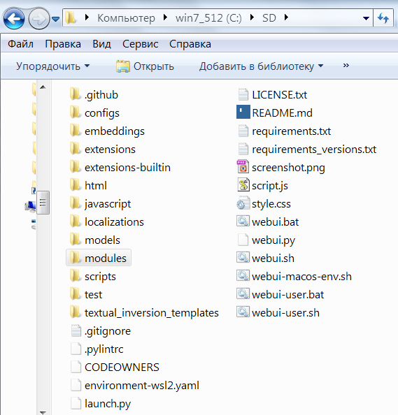

# ***Руководство по установке Stable Diffusion***
В данном мануале я вкратце по пунктам расписал последовательность действий, которые необходимо произвести для установки и настройки ***для дальнейшего использования оффлайн (без необходимости постоянного подключения к интернету)*** нейросети **Stable Diffusion** на локальном компьютере под управлением ОС Windows 10 с видеокартой **NVIDIA** (***c объёмом видеопамяти от 2Гб и выше***).

Нижеперечисленные пункты подразумевают, что процесс установки и настройки будет произведен на свежеустановленной Windows 10 x64 (чтобы исключить некоторые возможные ошибки на "голой" Windows, при отсутствии некоторых библиотек, необходимых для работы Stable Diffusion).

  
# Установка Stable Diffusion (SD) для использования оффлайн:
1. Узнать все характеристики твоей дискретной видеокарты, бесплатная программа GPU-Z: https://www.techpowerup.com/download/techpowerup-gpu-z/


2. Скачать драйвера для своей видеокарты: https://www.nvidia.com/Download/index.aspx


3. Скачать и установить Microsoft Visual C++ Redistributable (VCredist). 

Это свободно распространяемый пакет, включающий компоненты, необходимые для запуска программ, написанных на языке С++ при помощи Visual Studio. Для первого запуска Stable Diffusion на "голой" Windows 10 в моем случае потребовались библиотеки из этого пакета. Выбрать необходимо пакет, который соответствует разрядности вашей операционной системы (32-разрядная - x86, 64-разрядная - x64): https://learn.microsoft.com/ru-RU/cpp/windows/latest-supported-vc-redist?view=msvc-170


4. Скачать и установить интерпретатор языка python версии 3.10.6: https://www.python.org/downloads/windows/


Выбрать необходимо дистрибутив, который соответствует разрядности вашей операционной системы (32-разрядная - x86, 64-разрядная - x64). 
Прямая ссылка на скачивание 64-разрядной версии с оффициального сайта разработчиков: https://www.python.org/ftp/python/3.10.6/python-3.10.6-amd64.exe
При установке соглашаемся со всем и жмем везде "**Next**", но не забываем поставить галочку «**Add to PATH**».

5. Установить Git Bash: https://git-scm.com/download/win


Выбрать необходимо дистрибутив, который соответствует разрядности вашей операционной системы (32-разрядная - x86, 64-разрядная - x64).

6. Установить web-оболочку для Stable Diffusion - Automatic1111.

Для этого создать в корне диска папку без кириллицы в названии (например - "**SD**"). Желательно, чтобы диск был скоростной (это моя рекомендация для ускорения работы со Stable Diffusion, работать будет и без этого). Перейти в эту папку, нажать правую клавишу мыши и выбрать в появившемся контекстном меню пункт "**Git Bash here**", вставить в появившемся консольном окне:
```bash
git clone https://github.com/AUTOMATIC1111/stable-diffusion-webui.git
```
Альтернативный вариант: если по какой-то причине пункт "**Git Bash here**" отсутствует в меню, то перейти в браузере по ссылке:
```bash
https://github.com/AUTOMATIC1111/stable-diffusion-webui
```
Нажать на открывшейся странице клавишу "**Code**", выбрать пункт "**Download ZIP**", скачать архив и распаковать в созданную ранее папку "**SD**".


В итоге у вас должна быть такая структура файлов в созданной папке "**SD**":



7. Скачать по прямой ссылке с сайта **huggingface.co** веса модели для нейросети Stable Diffusion 1.5:

https://huggingface.co/runwayml/stable-diffusion-v1-5/resolve/main/v1-5-pruned-emaonly.ckpt

Сам файл после загрузки переместить в папку:
***\SD\models\Stable-diffusion***


8. В любом текстовом редакторе открыть файл webui-user.bat (правой клавишей мыши по файлу - выбрать "Изменить"), находящийся в корне созданной папки "**SD**".

Для возможности работы с нейросетью на видеокартах с объемом памяти менее 4Гб в строке "**set COMMANDLINE_ARGS**" добавить следующие аргументы: 
```bash
--medvram --opt-split-attention
```
 (*пояснения по этим и другим аргументам* - ***смотри ниже по тексту данной инструкции***), а первой строкой в файле добавить "**git pull**" (для автоматической проверки обновлений web-оболочки Automatic1111). 
Сохранить изменения.
После редактирования файл должен иметь следующее содержание:


9. Запустить файл webui-user.bat (откроется консольное окно), подождать минут 15-30 (в зависимости от характеристик вашего компьютера) - пока загрузятся все необходимые зависимости, библиотеки и веса прочих нейронок, что используются при работе web-интерфейса Automatic1111.

После того как загрузка всего необходимого завершится - скопировать из окна консоли адресс "http://127.0.0.1:7860" и вставить в браузер.

10. Пользоваться нейронкой в удовольствие и творить чудеса)


# Аргументы и настройки командной строки Automatic1111 (используемые в файле webui-user.bat) 

***--medvram*** : включить оптимизацию SD-моделей - использует меньше памяти видеокарты и увеличивает время генерации, позволяет запустить генерацию на слабых видеокартах;

***--lowvram*** : включить оптимизацию SD-моделей - использует еще меньше памяти видеокарты и увеличивает время генерации, позволяет запустить генерацию на слабых видеокартах - *использовать, если не помогла команда* ***--medvram***

***--opt-split-attention*** : принудительное включение оптимизации перекрестного слоя внимания Doggettx (данную опция, дополнительно к тем,что перечислены выше, поможет генерировать на видекартах с обьемом видеопамяти 2-3Гб)

***--no-half*** : не переключать модель на 16-битные плавающие числа;

***--xformers*** : ускоряет генерацию за счет более простых методов;

***--autolaunch*** : автозапуск браузера с web-интерфейсом;

***--theme=dark*** : темная тема для web-интерфейса;

***--api*** : параллельно с web-интервейсом весь функционал сборки Automatic11111 будет доступен и черзе API (требуется при использовании разного рода плагинов к внешним программам, которые использует возможности Automatic1111 через API)

# Рекомендации от разработчиков Automatic1111
**При работе на видеокартах с низким объемом видеопамяти (<= 4 ГБ)** могут возникать ошибки нехватки памяти. Различные оптимизации могут быть включены с помощью аргументов командной строки, жертвуя некоторой / значительной скоростью в пользу использования меньшего объема видеопамяти:

- Если у вас 4 ГБ видеопамяти и вы хотите создать изображения размером 512x512 (или, возможно, до 640x640), используйте ***--medvram***;
- Если у вас 4 ГБ видеопамяти и вы хотите создать изображения размером 512x512, но получаете сообщение об ошибке нехватки памяти *--medvram*, используйте ***--lowvram --always-batch-cond-uncond*** вместо этого;
- Если у вас 4 ГБ видеопамяти и вы хотите сделать изображения больше, чем вы можете ***--medvram***, используйте ***--lowvram***;
- При работе на видеокартах, которые не поддерживают числа с плавающей запятой половинной точности (известная проблема **с картами 16xx**), вместо сгенерированных изображений может отображаться зеленый или черный экран. Это может быть исправлено с помощью аргументов командной строки ***--precision full --no-half*** при значительном увеличении использования видеопамяти, что может потребовать добавления аргумента ***--medvram***.

# Видеоинструкция по установке SD:

[](https://www.youtube.com/watch?v=IiZ359xZa0I)


## Готовые модели:
1. https://civitai.com
2. https://huggingface.co/models
3. https://rentry.org/sdmodels
4. https://www.reddit.com/r/stablediffusion/wiki/models/
4. https://neyrosety.ru/modeley-dlya-stable-diffusion/


## Попробовать бесплатно Stable Diffusion онлайн в браузере:
1. https://lexica.art/aperture
2. https://stablediffusionweb.com
